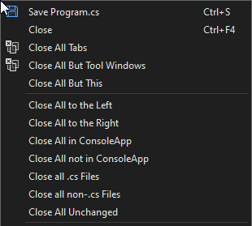

[repo]:https://github.com/ben-hamida/CloseTabs

# Close Tabs for Visual Studio

--------------------------------------

Adds a number of options for closing multiple tabs in the right-click context menu for docment tabs in Visual Studio.

## Features

* Close all tabs to the right of the selected document
* Close all tabs to the left of the selected document
* Close all documents in the same project or solution folder as the selected document
* Close all documents not in the same project or solution folder as the selected document
* Close all documents with the same file extension as the selected document
* Close all documents except those with the same file extension as the selected document
* Close all documents that don't have any unsaved changes

## Limtations

Only available for document windows, not for tool windows.

## Enjoying this extension?
If so, please give it a ★★★★★ rating on the Visual Studio Marketplace.

If you find any issues or have any feature requests, open an issue in the [GitHub repo][repo].
